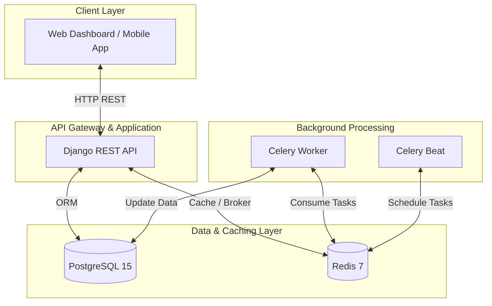
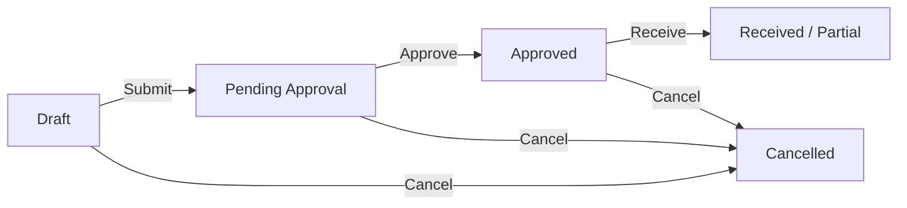

# SupplySync

SupplySync is an enterprise-grade, production-ready inventory and order management platform built with **Django**, **Django REST Framework**, **Celery**, and **Redis**.

It manages complex logistics workflows across multiple warehouses, maintaining absolute data integrity with row-level locking and providing real-time operational insights.

## 🏗️ System Architecture

SupplySync follows a **Service Layer Architecture**, strictly decoupling business logic from the HTTP request/response cycle.



## 🔄 Core Business Flows

### 📦 Sales Order Fulfillment
Ensures stock is reserved atomically to prevent overselling.

```mermaid
sequence_chart
    participant Client
    participant API
    participant DB
    participant Celery

    Client->>API: POST /api/v1/sales-orders/
    API->>DB: select_for_update (Lock Inventory)
    alt Stock Available
        API->>DB: Create SO (Confirmed)
        API->>DB: Reserve Stock (Available -X, Reserved +X)
        API->>Celery: Dispatch process_sales_order_created_event
        API->>Client: 201 Created
    else Insufficient Stock
        API->>Client: 422 Insufficient Stock
    end
```

### 🚚 Purchase Order Lifecycle
Manages the procurement process from draft to receipt.



## 🚀 Key Features

- **Inventory Control**: Real-time tracking across warehouses with `select_for_update()` to handle high concurrency.
- **Service Layer**: All business logic is encapsulated in `services.py` modules, making the code highly testable and reusable.
- **Event-Driven**: Celery workers process side-effects (notifications, logging) asynchronously.
- **Advanced Caching**: Redis semantic caching for product catalogs and dashboard metrics.
- **RBAC**: Fine-grained Role-Based Access Control (Admin, Warehouse Manager, Procurement Manager, Staff).
- **Unified Error Handling**: Consistent JSON error format across all endpoints.

## 🛠️ Technology Stack

- **Framework**: Django 5.x & DRF 3.15.x
- **Database**: PostgreSQL 15 (Relational Data)
- **Cache/Broker**: Redis 7 (Caching & Celery Broker)
- **Task Queue**: Celery (Background Processing)
- **Security**: JWT (Stateless Authentication)
- **Documentation**: drf-spectacular (OpenAPI 3.0)
- **Testing**: Pytest & Pytest-Django

## 📥 Local Setup

### 1. Environment Preparation
```bash
python -m venv venv
source venv/bin/activate  # Windows: venv\Scripts\activate
pip install -r requirements.txt
```

### 2. Infrastructure
Ensure Docker is running, then start the database and cache:
```bash
docker-compose up -d postgres redis
```

### 3. Database & Workers
```bash
python manage.py migrate
# Start workers in separate terminals or via Docker
docker-compose up -d celery_worker celery_beat
```

### 4. Run Application
```bash
python manage.py runserver
```

## 🧪 Testing

The project maintains high test coverage for both Service Layer and View Layer.

```bash
pytest
```

---

For deep-dive technical details, refer to:
- [Architecture Documentation](docs/architecture.md)
- [Developer Guide](docs/developer-guide.md)
