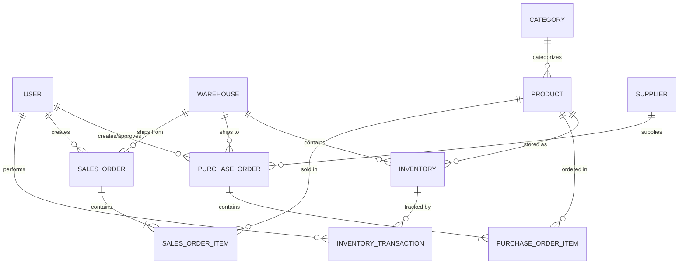
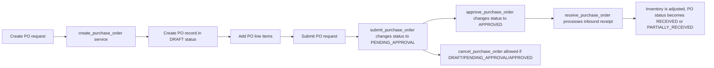
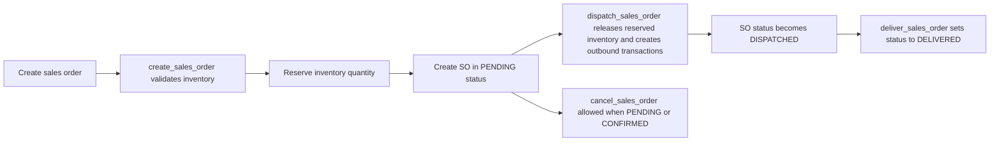
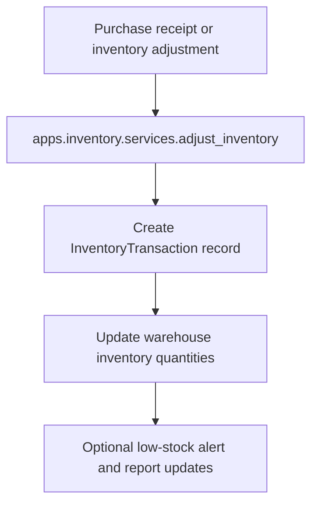

# SupplySync Architecture

This document describes how SupplySync is organized, how data and workflows move through the backend, and how the various subsystems interact.

## System Overview

SupplySync is a service-oriented Django backend with REST APIs and background processing via Celery.

- **Web API layer**: Django + Django REST Framework
- **Authentication**: JWT access/refresh tokens using `djangorestframework-simplejwt`
- **Background tasks**: Celery workers and Celery Beat
- **Cache and broker**: Redis
- **Primary database**: PostgreSQL in production, SQLite for testing

## Component Map

- `apps/accounts`: user registration, authentication, password management
- `apps/products`: product catalog, SKU management, pricing
- `apps/warehouses`: warehouse metadata, filters, and lookup
- `apps/inventory`: inventory levels, reserved quantity, transaction audit
- `apps/purchase_orders`: purchase order lifecycle
- `apps/sales_orders`: sales order lifecycle
- `apps/suppliers`: supplier metadata and contact information
- `apps/reports`: runtime reports and reporting endpoints
- `core`: shared helpers, exceptions, pagination, throttling, permissions

## 🗄️ Database Schema (ERD)

The following diagram represents the core entities and their relationships. All models inherit from a `BaseModel` providing `created_at`, `updated_at`, and soft-delete capabilities.



## High-Level Flow Charts

### 1. User Authentication Flow

```mermaid
flowchart TD
    A[Client submits login request] --> B[LoginView validates credentials]
    B --> C[authenticate(email, password)]
    C -->|valid| D[login_user service updates last login and issues tokens]
    D --> E[Return access_token + refresh_token]
    C -->|invalid| F[Return 401 NOT_AUTHENTICATED]
```

### 2. Purchase Order Lifecycle



### 3. Sales Order Lifecycle



### 4. Inventory Transaction Flow



## Data Flow and Responsibilities

### Authentication and Authorization

- `apps/accounts/views.py` handles API requests.
- `apps/accounts/serializers.py` validates payloads.
- `apps/accounts/services.py` performs business logic and token generation.
- `core/throttles.py` enforces login rate limiting.
- `core/exceptions.py` standardizes API errors.

### Purchase Order Processing

- `apps/purchase_orders/services.py` orchestrates PO creation, submission, approval, receiving, and cancellation.
- Incoming receipt operations adjust inventory through `apps.inventory.services.adjust_inventory`.
- Purchase order receiving triggers a background task via `process_purchase_order_received_event`.

### Sales Order Processing

- `apps/sales_orders/services.py` validates stock before order creation.
- Inventory is reserved at order creation and released on cancellation or dispatch.
- Dispatch and delivery actions update order status and create inventory transaction records.
- `process_sales_order_created_event` and `process_sales_order_cancelled_event` are asynchronous task hooks.

## Error Handling

SupplySync uses a centralized exception handler in `core/exceptions.py` that returns a unified response shape:

- `timestamp`
- `status`
- `error_code`
- `message`
- `path`
- `errors`

This provides consistent API responses for validation failures, authentication errors, resource not found, invalid operations, and internal errors.

## Notes on the Service Layer

- Core business logic lives in `services.py` modules inside each app.
- Views delegate validation and request handling to serializers before calling services.
- This keeps controller code thin and business rules centralized.

## Architecture Diagram Summary

SupplySync is designed for maintainability and extensibility:

- APIs in Django REST Framework
- Authentication via JWT
- Background jobs through Celery
- Redis for caching and broker
- Modular app boundaries for each domain area
- Centralized exception format for consistent API behavior
